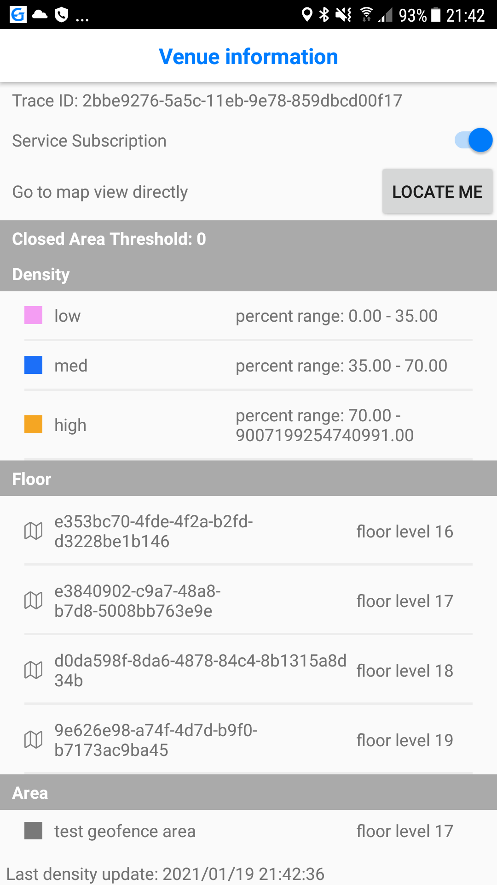
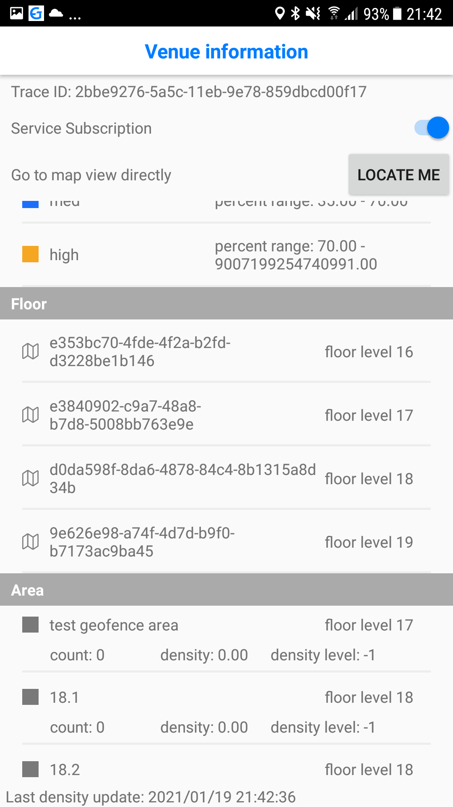
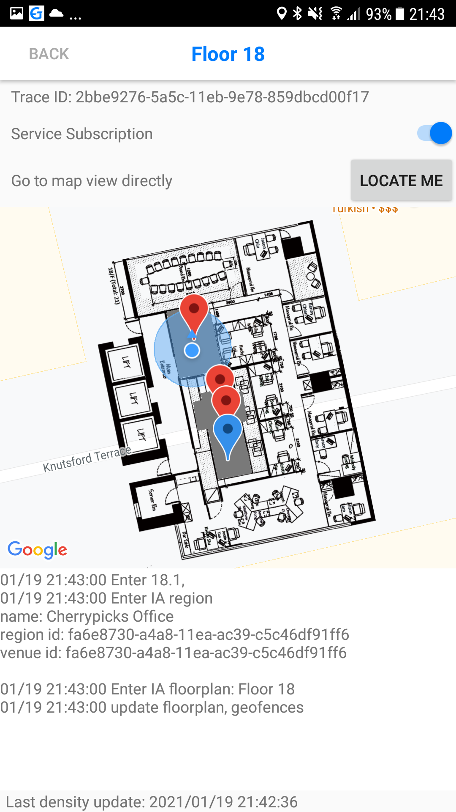

# GroundSage example APP

## Development

### Prerequisite

* Android Studio 4.0+ & Java
* `gem install bundler`
* Min. Android 6.0 (API level 24)

### Build example app in Android Studio

* Checkout repository `git clone git@github.com:IndoorAtlas/android-groundsage-example.git`
* For input Indooratlas API key and secret , set meta data `IAGSAPIKey` and `IAGSSecretKey` into application manifest 
* Open the project in Adroid Studio and build

## Application

It demonstrates basic Groundsage SDK features as crowd density monitoring system and some Indooratlas features including indoor positioning, floor plan handling, and multi-floor wayfinding, and other useful functionality, such as floor plan image caching, visualization, and points-of-interest (POIs).

### Crowd density information

* **Venue Information**: Obtain venue information when you open the app with available network. It shows a list view including density level, floor and geofence area information.
* **Start subcription**: Obtain trace id and latest crowd density update when you are in region and switch on subscription button.

<table><tr>
<td></td>
<td></td>
</tr></table>

### User Interface on venue information view
* **Go to map view**: You can go to map view directly by clicking `locate me` button, it shows your current position. Or clicking floor row to see geofence area on other floor.
* **Show alert message**: It also shows alert message if you turn off network, location setting and bluetooth.
* **Foreground service**: It runs foreground service to obtain current position for crowd density accurancy.

### User Interface on map view

* **Positioning**: Shows the current position estimate and its uncertainty circle
* **Geofence (cloud)**: Visualizes geofence area with its name and latest density color, shows log message when enter / exit that area
* **Geofence (dynamic)**: Visualizes geofence area with its name, shows log message when enter / exit that area
* **Wayfinding**: Offers wayfinding and visualizes wayfinding paths, when you tap the map or click a marker
* **Points-of-interest**: Visualizes the POIs defined for the venue. Selecting a POI will toggle wayfinding and show its data.

